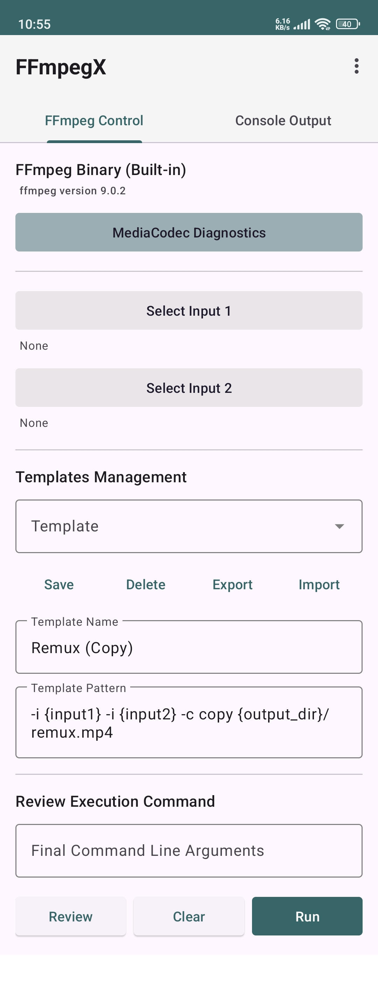

# FFmpegX — Developer Documentation

Developer-level documentation of the FFmpegX Android application's process
logic, architecture, strengths, and potential improvements.

The core Android workflow is:

Android URI / input selection

↓

Local filesystem input

↓

Template / editable FFmpeg command

↓

Argument parsing

↓

ProcessBuilder → FFmpeg

↓

Private application output

↓

MediaStore publication

↓

Private temporary output deleted

## 1\. Overview

FFmpegX provides a graphical frontend for running FFmpeg commands without
requiring the user to interact with a shell. It combines simple GUI controls
with an editable command line, allowing common conversions as well as advanced
FFmpeg usage.

FFmpeg remains responsible for media processing. FFmpegX manages file
selection, command construction, process execution, output display, and final
storage.

## 2\. Architecture

**Input selection** — Android content URI or filesystem path

**Path resolution** — obtain a local filesystem path

**Template processing** — substitute input/output placeholders

**Review** — display the generated command

**Argument parsing** — turn the command into an argument list

**ProcessBuilder** — execute FFmpeg directly

**Live output** — display FFmpeg stdout/stderr

**Publication** — copy completed output to MediaStore

**Cleanup** — delete the temporary private output

This separation keeps FFmpegX focused on interaction, storage access, process
lifecycle, and presentation.

## 3\. Startup and Persistent State

`MainActivity` starts the Compose UI through `FFmpegXScreen()`. Startup
restores persisted settings, requests required media permissions, restores
command templates and the selected FFmpeg binary, and checks the FFmpeg
version.

  * Selected FFmpeg binary path
  * Saved command templates
  * Application configuration

Initial input/output locations use application-accessible external storage
where available, falling back to the application's files directory.

## 4\. FFmpeg Binary Management

The selected FFmpeg binary is copied into private application storage as
`custom_ffmpeg`.

    
    
    copyBinaryToInternal()
        ↓
    delete previous custom binary
        ↓
    copy selected URI into filesDir/custom_ffmpeg
        ↓
    set executable permission
        ↓
    persist binary path

Version information is obtained by executing `ffmpeg -version` and displaying
the first relevant line.

## 5\. URI and File Handling

Android file selection commonly returns a `content://` URI rather than a
traditional filesystem path. `getPathFromUri()` therefore uses a layered
approach:

  1. Handle `file://` directly.
  2. Attempt the legacy MediaStore `DATA` column.
  3. If no real path is available, copy URI content into the cache directory.
  4. Return the resulting local path.

File names use `OpenableColumns.DISPLAY_NAME` with a URI-path fallback.

## 6\. Command Template System

Templates provide reusable FFmpeg command patterns. The user can select, load,
edit, save, and delete templates.

Placeholder| Meaning  
---|---  
`{input1}`| First selected input file  
`{input2}`| Second selected input file  
`{output_dir}`| Selected output directory  
  
The template system is deliberately a command-pattern system rather than a
restrictive list of predefined operations.

For the Linux implementation, the same model is used with `{output_dir}` as
the final destination, for example:

    
    
    -i {input1} -c copy {output_dir}/output.mp4

## 7\. Command Generation and Review

The application substitutes selected input/output values into the command
pattern. Values are quoted before insertion. The intended workflow is:

  1. Select inputs.
  2. Select output destination.
  3. Select or enter a template.
  4. Generate the command.
  5. Review or edit it.
  6. Run FFmpeg.

The actual FFmpeg command remains visible and editable, preserving advanced-
user flexibility.

## 8\. Argument Parsing

The Android implementation uses a character-by-character parser supporting
whitespace plus single- and double-quoted arguments. The resulting arguments
are passed separately to `ProcessBuilder`.

    
    
    -i "/path/My Video.mp4" -c copy "/path/output file.mp4"

Conceptually this becomes:

    
    
    ["-i", "/path/My Video.mp4", "-c", "copy", "/path/output file.mp4"]

This avoids relying on a shell for command interpretation.

## 9\. FFmpeg Process Execution

FFmpeg is executed with `ProcessBuilder`, not through `sh -c`. Standard output
and standard error are combined with `redirectErrorStream(true)`. Execution
occurs on `Dispatchers.IO`.

    
    
    command string
        ↓
    argument parser
        ↓
    List<String>
        ↓
    ProcessBuilder
        ↓
    FFmpeg process

## 10\. Real-Time Console Output

FFmpeg output is read while the process is running and displayed in the
status/output interface. Combining stdout and stderr makes the interface
behave like an FFmpeg terminal and exposes codec, parameter, input, output,
and runtime errors.

## 11\. MediaStore Publication

On Android, application-private output is not automatically equivalent to a
normal user-visible media file. `publishToPublic()` creates a MediaStore
entry, copies the completed private file into it, and finalizes the item.

### Single output directory design

The simplified design can put all FFmpegX output into:

    
    
    Movies/FFmpegX

MIME type identification may still be retained for metadata, but it does not
need to determine the destination. Unknown extensions may use
`application/octet-stream` while still being stored in `Movies/FFmpegX`.

### MediaStore pending state

On Android Q and later, `IS_PENDING=1` is used during copying and
`IS_PENDING=0` after successful completion, preventing a partial file from
being exposed as complete.

## 12\. Post-Publication Cleanup

After successful MediaStore publication, the application executes:

    
    
    privateFile.delete()

This is intentionally performed only after the file has been completely copied
and the MediaStore item finalized. It prevents two complete copies of a
potentially large media file from being retained.

Without cleanup| With cleanup  
---|---  
2 GB private + 2 GB public = 4 GB retained| 2 GB public remains after
publication  
  
A useful refinement is to check the Boolean return:

    
    
    if (!privateFile.delete()) {
        // Log cleanup failure.
    }

A cleanup failure should generally be treated as a storage-cleanup problem
rather than a failed conversion when the public copy already succeeded.

## 13\. Architectural Strengths

### 1\. Direct FFmpeg execution

FFmpeg is launched directly rather than through a shell, giving predictable
argument handling.

### 2\. Reviewable and editable commands

The user can inspect and modify the actual FFmpeg command.

### 3\. Real-time diagnostic output

FFmpeg output is visible while operations run, making failures easier to
diagnose.

### 4\. Background execution

Long-running work is kept away from the UI thread.

### 5\. Flexible URI fallback

The application can handle providers that do not expose a conventional
filesystem path.

### 6\. Persistent configuration

The FFmpeg binary and templates can survive application restarts.

### 7\. Efficient storage lifecycle

Temporary private output is removed after successful publication.

### 8\. Minimal assumptions about FFmpeg

The frontend delegates codec and container functionality to FFmpeg instead of
attempting to reproduce it.

## 14\. Potential Improvements

### 14.1 Stop / Cancel support

Retain the active process reference and expose a Stop button; use `destroy()`
followed by `destroyForcibly()` if necessary.

### 14.2 Prevent concurrent runs

Disable Run while FFmpeg is active.

### 14.3 ViewModel separation

Move process state, templates, and execution logic into a ViewModel to improve
lifecycle handling.

### 14.4 Console buffering

A bounded or buffered console model would scale better for very verbose
operations than repeatedly rebuilding a large string.

### 14.5 Parser validation

Detect unmatched quotes and report a useful error before starting FFmpeg.

### 14.6 Template persistence

JSON would be more extensible if templates later acquire descriptions,
categories, or metadata.

### 14.7 URI strategy

Reliance on the legacy `MediaStore.DATA` column could be reduced by
consistently copying content URIs into application storage when a filesystem
path is unavailable.

### 14.8 Publication error handling

Explicitly handle a null MediaStore insertion result and clean up partially
created MediaStore items when appropriate.

### 14.9 Publication sequencing

Await or sequence publication operations when processing multiple outputs so
completion and cleanup ordering is deterministic.

### 14.10 Scanner timing

Review scanner usage alongside MediaStore publication, particularly on Android
Q+.

### 14.11 Future modular structure

Component| Responsibility  
---|---  
`FFmpegRunner`| Process creation, execution, output and cancellation  
`StorageManager`| URI resolution, temporary files and publication  
`TemplateRepository`| Template persistence and CRUD  
`FFmpegViewModel`| UI state and lifecycle-aware orchestration  
`FFmpegXScreen`| Compose UI  
  
## 15\. Linux PySimpleGUI Variant

The Linux version follows the same conceptual process while removing Android-
specific MediaStore publication.

Input file selection

↓

Select Output Dir

↓

Template / editable command

↓

Placeholder substitution

↓

`shlex.split()`

↓

`subprocess.Popen()`

↓

Direct output into selected directory

The selected output directory is the final destination. A template can use:

    
    
    -i {input1} -c copy {output_dir}/output.mp4

This preserves the template, review, argument parsing, direct process
execution, and live-output concepts.

## 16\. Overall Process Summary

    
    
    FFmpegX
      │
      ├─ Select input files
      ├─ Select/load template
      ├─ Substitute paths and output directory
      ├─ Review / edit
      ├─ Parse arguments
      ├─ ProcessBuilder → FFmpeg
      ├─ Live console output
      ├─ Android: MediaStore / Linux: direct output
      └─ Android: delete temporary private output

The central design principle is to keep the frontend thin: FFmpegX handles
interaction, path handling, command construction, process management,
diagnostics, and final storage, while FFmpeg remains the media-processing
engine.

FFmpegX — Developer Documentation
